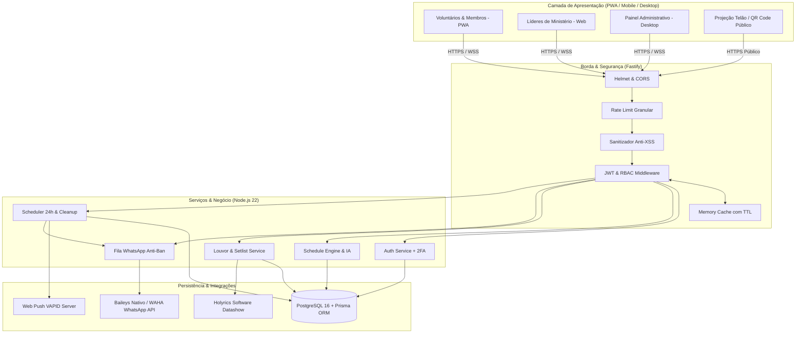

# 🏛️ Arquitetura Sistêmica — Volutis PIBI

**Projeto**: Volutis PIBI — Sistema de Gestão Ministerial, Escalas e Apoio ao Culto  
**Idealizador e Desenvolvedor**: Alexandre Calmon Jr.  
**Igreja**: Primeira Igreja Batista de Itapuã (PIBI)  
**Versão**: 2.5.0  

---

## 1. Visão Geral do Sistema

O **Volutis PIBI** foi concebido para transformar a operação diária dos ministérios da igreja, automatizando fluxos manuais e substituindo planilhas desatualizadas por um ecossistema digital integrado, rápido e acessível de qualquer smartphone, tablet ou computador.

### Objetivos Estratégicos:
1. **Escala Justa e Inteligente**: Evitar sobrecargas de voluntários, duplicidades no mesmo culto (*Double Booking*) e conflitos de agenda.
2. **Engajamento e Comunicação Direta**: Notificações in-app, Web Push no celular e mensagens interativas via WhatsApp.
3. **Apoio Técnico ao Culto**: Integração nativa com Holyrics, Metrônomo com cifras de palco e Central de Ajuda operacional (Helpdesk de TI, Som e Mídia).
4. **Captação e Triagem**: Formulário público por QR Code projetado no telão durante os cultos para novos voluntários.

---

## 2. Topologia do Monorepo

O projeto adota uma estrutura monorepo clara e desacoplada:

```
Volutis-PIBI/
├── client/                     # Frontend SPA & PWA (React 19, TypeScript, Vite)
├── server/                     # Backend API REST & WebSockets (Fastify 5, Node.js 22)
│   ├── prisma/                 # Modelagem relacional e migrações PostgreSQL
│   └── uploads/                # Armazenamento local de mídias e avatares
├── docs/                       # Suíte completa de documentação técnica
├── Dockerfile                  # Build multi-stage otimizado para produção
└── docker-compose.yml          # Orquestração local (App + PostgreSQL + WAHA)
```

---

## 3. Diagrama de Arquitetura e Fluxo de Dados



---

## 4. Decisões Arquiteturais e Padrões de Projeto

### 4.1 Frontend (React 19 + PWA)
- **Zero Inchaço de Dependências**: Uso prioritário de CSS moderno com variáveis (`:root` e `.dark`), dispensando bibliotecas CSS pesadas em runtime.
- **Gerenciamento de Estado Reativo**: `zustand` com persistência em `localStorage` para sessão, tokens JWT, preferências de tema e estado offline.
- **Progressive Web App (PWA)**: Manifest integrado com ícones nativos e service worker para instalação em dispositivos Android e iOS.
- **Canvas Rendering Nativo**: Geração de cards visuais da escala em tempo de execução via HTML5 Canvas sem depender de servidores de renderização de imagem externos.

### 4.2 Backend (Fastify 5 + TypeScript)
- **Fastify sobre Express**: Escolhido pelo throughput até 4x superior, validação nativa com schemas e suporte a HTTP/2 e compressão Brotli.
- **Camada de Cache em Memória (`appCache`)**: Cache em memória com expiração por TTL e invalidação sob demanda, poupando até 70% das consultas ao banco de dados no horário de pico dos cultos.
- **Fila com Controle de Vazão para WhatsApp**: Intervalo controlado de 2.5s entre disparos para evitar bloqueios de operadora/WhatsApp.
- **Soft Delete e Integridade**: Tabelas críticas possuem campo `deletedAt` para preservação do histórico ministerial da igreja.
