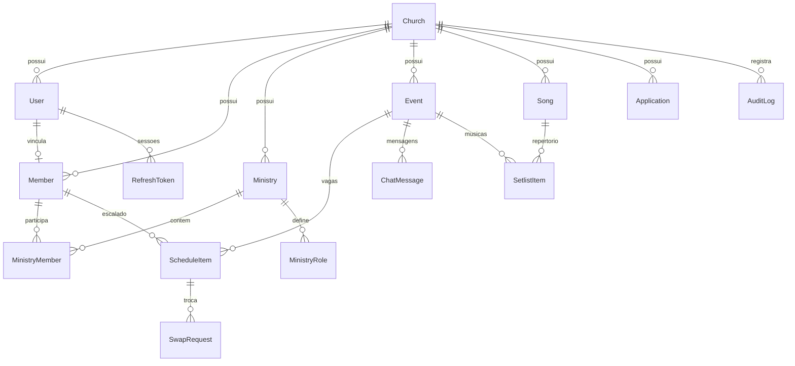

# 🗄️ Modelagem do Banco de Dados — Volutis PIBI

**SGBD**: PostgreSQL 16  
**ORM**: Prisma 6  
**Localização do Schema**: `server/prisma/schema.prisma`  

---

## 1. Diagrama Entidade-Relacionamento (ERD)



---

## 2. Dicionário das Principais Tabelas

### 2.1 `Church` (Organização)
Representa a igreja detentora dos dados, permitindo arquitetura multi-tenant limpa.
- `id`: UUID (Primary Key).
- `name`: Nome da igreja (ex: *"Primeira Igreja Batista de Itapuã"*).
- `slug`: Identificador único para formulários públicos (`/cadastro/pibi`).
- `holyricsEnabled`: Flag para ligar/desligar a sincronização com o software de projeção.

### 2.2 `User` (Contas de Acesso)
- `id`: UUID.
- `email`: E-mail único de login.
- `passwordHash`: Hash criptografado via bcrypt (10 rounds).
- `role`: Perfil de acesso (`ADMIN`, `MINISTRY_LEADER`, `VOLUNTEER`, `MEMBER`).
- `phone`: Telefone com código de área (+55) para login direto e 2FA.

### 2.3 `Member` (Perfil Ministerial)
- `id`: UUID vinculado ao `User` correspondente.
- `name`: Nome completo.
- `points`: Pontuação acumulada para gamificação ministerial.
- `approvalStatus`: Status de aprovação (`ACTIVE`, `PENDING`, `INACTIVE`).

### 2.4 `Ministry` & `MinistryMember` (Ministérios e Vínculos)
- `deletedAt`: Data de exclusão lógica (*Soft Delete*). Quando não for nula, o ministério fica oculto sem quebrar o histórico de cultos passados.
- `isLeader`: Booleano que define se o voluntário lidera o ministério correspondente.

### 2.5 `ScheduleItem` (Vagas de Escala)
- `status`: Estado da escala (`PENDING`, `CONFIRMED`, `DECLINED`, `SWAP_REQUESTED`).
- `reminderSentAt`: Timestamp de quando o lembrete de 24h foi disparado.

### 2.6 `AuditLog` (Histórico de Ações)
- Registra operações críticas: exclusões, resets, aprovações de membros e alterações de escalas.
- Campos: `action`, `category`, `actorId`, `actorName`, `actorRole`, `ipAddress`, `details` (JSON) e `createdAt`.

---

## 3. Estratégia de Índices Compostos e Performance

Para garantir consultas instantâneas mesmo com centenas de milhares de linhas acumuladas:

```prisma
model ScheduleItem {
  // Índices para busca ultra-rápida de voluntários e eventos
  @@index([memberId, status])
  @@index([eventId, status])
  @@index([reminderSentAt])
}

model ChatMessage {
  // Ordenação cronológica acelerada no chat do culto
  @@index([eventId, createdAt])
}

model UserNotification {
  // Contagem instantânea do sininho de notificações não lidas
  @@index([memberId, readAt, createdAt])
}

model FeedPost {
  @@index([churchId, createdAt])
}
```

---

## 4. Política de Backup e Restauração

1. **Backup JSON com 1 Clique**:
   - Disponível no painel administrativo via endpoint `GET /api/admin/backup`.
   - Gera um snapshot completo em JSON com membros, ministérios, eventos, escalas, louvores e logs de auditoria.
2. **Dump Físico PostgreSQL (`pg_dump`)**:
   ```bash
   pg_dump -U postgres -d volut_db -F c -b -v -f backup_volut_$(date +%Y%m%d).dump
   ```
3. **Restauração (`pg_restore`)**:
   ```bash
   pg_restore -U postgres -d volut_db -v backup_volut_20260902.dump
   ```
